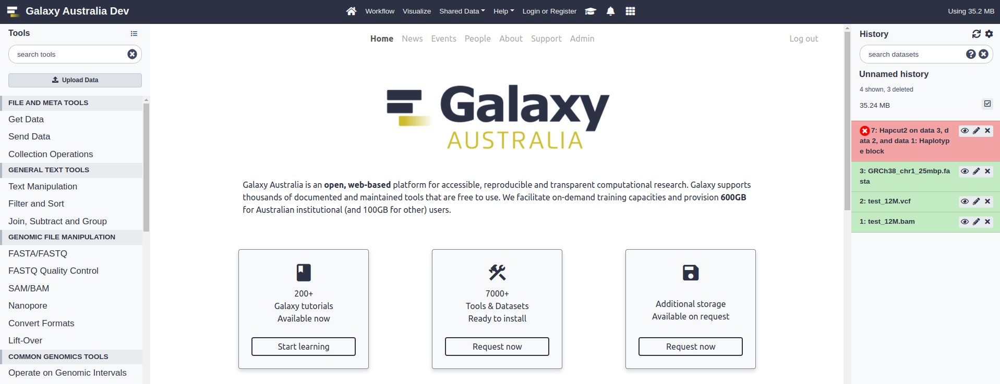

# Galaxy Media Site (GMS)

A simple content site for a Galaxy instance, built with Django.

---

For developer docs, please [check out the wiki](https://github.com/usegalaxy-au/galaxy-media-site/wiki/Development).
[Administration](https://github.com/usegalaxy-au/galaxy-media-site/wiki/Site-administration) is also well-documented there.

## Branches

The commit process is documented in the [dev wiki](https://github.com/usegalaxy-au/galaxy-media-site/wiki/Development).

`dev` - development branch deployed to https://dev-site.gvl.org.au

`main` - production branch deployed to https://site.usegalaxy.org.au

## What it does

This web app is designed to host content related to a [Galaxy](https://galaxyproject.org/) instance. It is lightweight, easy to install and maintain, and provides interfaces for publishing:

- A dynamic landing page for the Galaxy instance
- Galaxy Lab landing pages
- Landing page notices
- Event posts
- News articles (including automated tool updates)
- Team members

The site also hosts support webforms and static pages like "about" content, terms of service etc.
There is also a rudimentary facility for sending bulk mail and handling unsubscribe requests (this requires better integration with site, the currently file R/W is a bit hacky and error prone).

This content is all embedded in HTML templates. If you fork the repository, these templates can be updated with content relevant to your Galaxy instance, and new pages can be added too.

The GMS homepage (aka landing page) is designed to be displayed as your Galaxy instance "welcome" page. Just create a `welcome.html` file with an `iframe` that points to https://mygms.com/landing to get a landing page without the navbar.

The site is designed to be fully navigable from within your Galaxy instance, with the GMS Navbar being nested under the main Galaxy navbar:




**A note on iframe behaviour**

When requested in an `<iframe>` from a Galaxy instance, GMS pages "know" that
they are in an `iframe` and will render slightly differently than if the user
was visting the GMS site directly. For developers, if there is content that
you'd like to render differently you can use the global `inIframe()` JavaScript
function on any page to check if you're currently in an iframe.

## This repository

- [deploy/](./deploy/) for deployment of GMS with Ansible and shell script
- [scrape/](./scrape/) python scripts for scraping content from the old jekyll site codebase
- [webapp/](./webapp/) this is the Django app

---

## Deployment

If you are setting this up for production, create a DNS record for your domain name before running the setup script - this should be an A record pointing to the IP address of the host machine. Subdomains are fine.

This app has been developed and tested on Ubuntu 20.04 LTS.
Other operating systems may require manual installation.
The application is installed on a Nginx-Gunicorn-Postgres stack
and is not containerized. We recommend installation in a fresh
virtual machine instance.

### Deploy with Ansible

If you're familiar with ansible, this is the recommended method of
deployment. See [deploy/ansible/](./deploy/ansible/).

### Deploy with shell

**Install and deploy the application in your webserver terminal:**

```bash
cd <my-projects-directory>
git clone https://github.com/usegalaxy-au/galaxy-media-site.git
cd galaxy-media-site
PROJECT_ROOT=$PWD

# Create a .env file here - see .env.sample
nano .env

# Follow prompts
./deploy/setup.sh

# Check operation with Django local serve
# Django will provide feedback on any issues detected
source deploy/.venv/bin/activate
python webapp/manage.py runserver
```

**A note on performance**

The app was tested with Locust against a web server with 1vCPU / 2GB RAM
(see `locustfile.py`). It could handle 500 concurrent users with <1s
response times before web performance started to degrade.

In 2021, peak traffic experienced by Galaxy Australia was below 1000
requests per hour, so it seems that a 1CPU machine can handle this service
adequately, based on the Locust model.

## Deploy the maintenance site

For any downtime, the maintenance site can be found [here](./deploy/maintenance-site/).

Point the DNS for your domain name to the host IP address.
Then, on your Ubuntu web server:

```sh
sudo apt install nginx
git clone https://github.com/usegalaxy-au/galaxy-media-site.git
cd galaxy-media-site
sudo ln -s /srv/sites/gms-maintenance-site ./deploy/maintenance-site

# Edit with your domain as the server_name
nano ./deploy/maintenance-site/nginx.conf
sudo cp ./deploy/maintenance-site/nginx.conf /etc/nginx/sites-available
sudo ln -s /etc/nginx/sites-available/nginx.conf /etc/nginx/sites-enabled/nginx.conf
sudo service nginx restart
```


---

## Site administration

Visit `/admin/login` and log in with a staff user account. If you don't have one, you can create one with the Django CLI.

*N.B. superuser creation is included in the Ansible playbook*

```bash
cd $PROJECT_ROOT
source deploy/.venv/bin/activate

# Follow prompts
python webapp/manage.py createsuperuser
```

Check out the [Wiki](https://github.com/usegalaxy-au/galaxy-media-site/wiki/Site-administration) to learn about site administration through the web admin.

---

## Migrating between servers

Application state is stored in the PostgreSQL database, with images in the [webapp/webapp/media](./webapp/webapp/media/) directory. If required, you can migrate the application between servers. This assumes some experience with postgres and the psql shell.

**N.B.** if the database username has changed, you will have to dump the database with the `--no-owner` flag and create privileges for the new owner manually in a `psql` shell.

**The following steps demonstrate migrating application state to a new machine:**

1. Grab a db dump on the old machine:

  ```
  sudo -u postgres pg_dump <DBNAME> > gms.sql
  ```

2. Install GMS on the new webserver with ansible or over the CLI (N.B your superuser will be overwritten in the following steps)

  **For Ansible deployment**

  Update `webservers.yml` with:

  ```yaml
  # Don't forget to remove this afterwards to resume migrations in the future!
  skip_database_migration: true
  ```

3. Drop and recreate the new database

  **For script/CLI deployment**
  ```
  sudo -u postgres psql -c "DROP DATABASE <DBNAME>"
  sudo -u postgres psql -c "CREATE DATABASE <DBNAME>"
  sudo -u postgres psql -c "GRANT ALL PRIVILEGES ON DATABASE <DBNAME> TO <user>"
  ```

  **For Ansible deployment**
  You already handled this in step 2, well done!

4. Load the db dump

  `sudo -u postgres psql -d <DBNAME> < gms.sql`

5. Check out the new site, the content should be there.

6. Images/media must be migrated separately. `tar` the [webapp/webapp/media](./webapp/webapp/media/) directory and send to the new server:
  ```
  # N.B. you will ssh access to the new webserver with sudo privileges

  REMOTE_ADDRESS=mynewsite.com
  REMOTE_PROJECT_ROOT=/path/to/the/new/galaxy-media-site
  cd $PROJECT_ROOT
  tar cf - webapp/webapp/media \
      | ssh $REMOTE_ADDRESS \ "(
          cd ${REMOTE_PROJECT_ROOT}/webapp/webapp;
          cat > media.tar;
          tar -xf media.tar && rm media.tar;
          sudo chown -R www-data:www-data media)"
  ```
  Your images should now be display on the new site.

8. If you are using a Jenkins task for automated news posts, you will need to update the Jenkins config if the hostname has changed. The API key should be unchanged.
