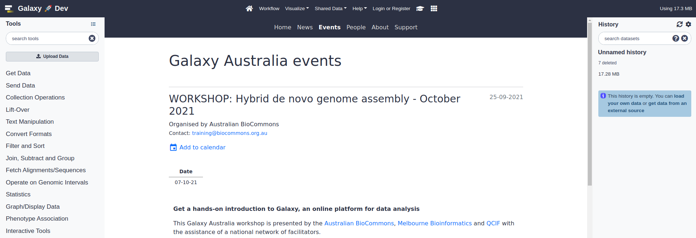

# Galaxy Media Site

A simple content site for a Galaxy instance, built with Django.

---

## What it does

This web application is designed to host content related to a [Galaxy](https://galaxyproject.org/) instance. It is lightweight, easy to install and maintain, and provides interfaces for publishing:

- Events
- News items (including automated tool updates)
- Team members
- Homepage alerts (Notices)

The site also hosts some static pages including:

- Terms of service
- Data policy
- About page

If you fork the repository, these templates can be updated with content relevant to your Galaxy instance.

The homepage is designed to be displayed as your Galaxy instance welcome page. Just create a `welcome.html` file with an `iframe` that points to https://mysite.com/landing to get a landing page without the navbar.

The site is designed to be fully navigable from within your Galaxy instance, with the Navbar being nested under the Galaxy navbar:



For admin docs, check out the [Wiki](https://github.com/neoformit/galaxy-content-site/wiki).

---

## Installation and deployment

If you are setting this up for production, create a DNS record for your domain name before running the setup script - this should be an A record pointing to the IP address of the host machine. Subdomains are fine.

```bash
# This app has been developed and tested on Ubuntu 20.04 LTS.
# Other operating systems may require manual installation.
# The application is installed on a Nginx-Gunicorn-Postgres stack
# and is not containerized. We recommend installation in a fresh
# virtual machine instance.

cd <my-projects-directory>
git clone https://github.com/neoformit/galaxy-content-site.git
cd galaxy-content-site
PROJECT_ROOT=$PWD

# Follow prompts
./deploy/setup.sh

# Check operation with Django local serve
# Django will provide feedback on any issues detected
source deploy/.venv/bin/activate
python webapp/manage.py runserver
```

> **A note on performance**
>
> The app was tested with Locust against a web server with 1vCPU / 2GB RAM
> (see locustfile.py). It could handle 500 concurrent users with <1s
> response times before web performance started to degrade.
>
> In 2021, peak traffic experienced by Galaxy Australia was below 1000
> requests per hour, so it seems that a 1CPU machine can handle this service
> adequately, based on the Locust model.

---

## Site administration

Visit `/admin/login` and log in with a staff user account. If you don't have one, you can create one with the Django CLI:

```bash
cd $PROJECT_ROOT
source deploy/.venv/bin/activate

# Follow prompts
python webapp/manage.py createsuperuser
```

Check out the [Wiki](https://github.com/neoformit/galaxy-content-site/wiki) to learn about site administration through the web admin.

---

## Migration

Application state is stored in the PostgreSQL database, with images in the `webapp/webapp/media` directory. If required, you can migrate the application between servers. This assumes some experience with postgres and the psql shell.

> N.B. if the database username has changed, you will have to dump the database with the `--no-owner` flag and create privileges for the new owner manually in a `psql` shell.

1. Grab a db dump on the old machine:

  `sudo -u postgres pg_dump <dbname> > gm.sql`

2. Git clone and run `deploy/setup.sh` on the new server (N.B your superuser will be overwritten in the following steps)

3. Drop and recreate the new database
  ```
  sudo -u postgres psql -c "DROP DATABASE <dbname>"
  sudo -u postgres psql -c "CREATE DATABASE <dbname>"
  sudo -u postgres psql -c "GRANT ALL PRIVILEGES ON DATABASE <dbname> TO <user>"
  ```

4. Load the db dump

  `sudo -u postgres psql -d <dbname> < gm.sql`

5. Check out the new site, the content should be there.

6. Images/media must be migrated separately. `tar` the `webapp/webapp/media` directory and send to the new server:
  ```
  cd $PROJECT_ROOT
  tar czf - webapp/webapp/media \
      | ssh <REMOTE-ADDRESS> \ "(
          cd <NEW_PROJECT_ROOT>/webapp/webapp;
          cat > media.tar.gz;
          tar -xzf media.tar.gz && rm media.tar.gz)"
  ```
  Images should now be display on the new site.

7. If you are using a Jenkins task for automated news posts, you will need to update the Jenkins config if the hostname has changed. The API key should be unchanged.
